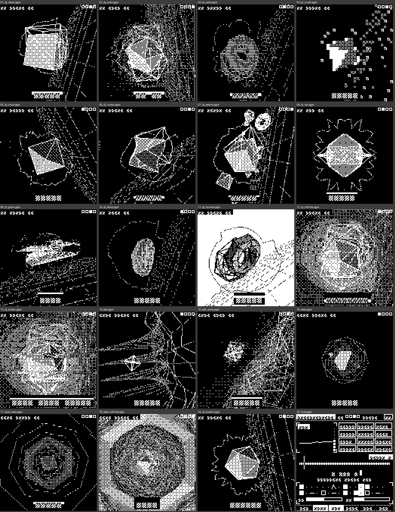
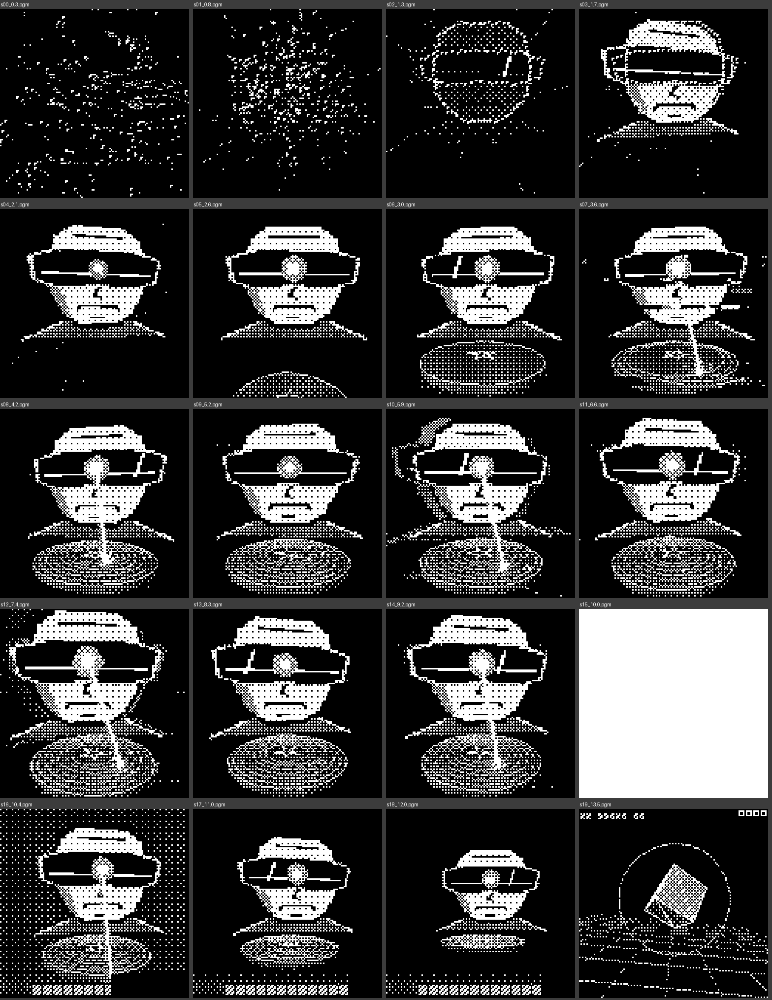
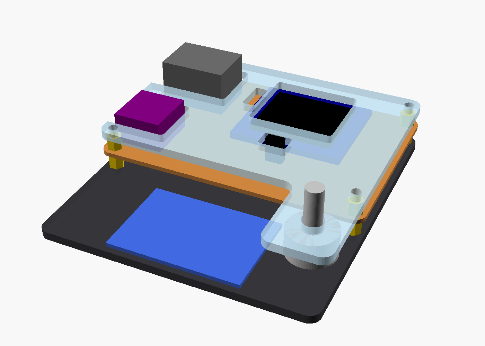
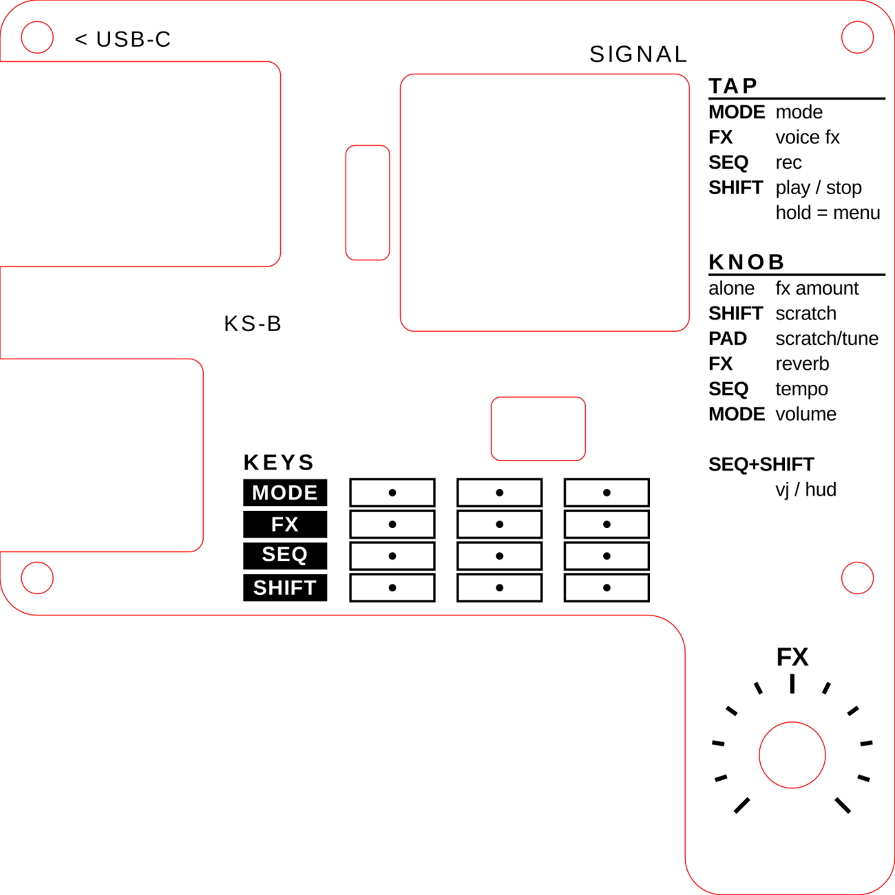

# CYBERSKRATCH

**A robot DJ on an ESP32-S3.** SAM (the 1982 Software Automatic Mouth) speaks words onto a turntable deck you
scratch, either tempo-synced by holding a pad or by hand with the knob. It also has a Speak & Spell mouth (Talkie LPC) you can bend and freeze, a
hip-hop drum machine, a 16-step sequencer and a rack of voice effects. It runs on a 4x4 keypad, one knob, a
128x128 OLED and a small speaker.

**New in this release:**
- **3D viz engine.** A small polygon renderer (flat-shaded solids, wireframes, painter's sort, glitch post-FX,
  Bayer dithering) drives a VJ view that plays along with the music, and a 3D intro film.
- **Laser-cut case.** A minimal top and bottom plate in 3 mm acrylic, with an engraved legend.

| 3D intro | Laser-cut case |
|---|---|
|  |  |

## What's in here

| Folder | Contents |
|---|---|
| `firmware/cyberskratch_3d/` | The Arduino sketch, with SAM's C core and the Talkie vocabularies bundled alongside |
| `firmware/cyberskratch_3d/host_sim/` | Desktop simulator: runs the real audio engine with g++ and saves VJ frames (see its README) |
| `hardware/laser_case/` | Minimal acrylic case: top plate (cut + engrave), bottom plate, OpenSCAD source, build notes |
| `docs/MANUAL.md` | How to play it |

The board itself (keypad synth rev B, single-sided, CNC-milled) is in the
**blasteroid-megasynth** repo under `hardware/`. CyberSkratch runs on the same board.

## Parts

| Part | Notes |
|---|---|
| ESP32-S3 **SuperMini** with **PSRAM** (4 MB flash / 2 MB PSRAM) | on 2x 1x9 female headers |
| MAX98357A I2S amp breakout + small 4-8 ohm speaker | VIN on 5 V |
| 1.5" 128x128 OLED, **SH1107**, I2C | VCC GND SCL SDA |
| 4x4 tact keypad module (passive matrix, e.g. QYF-JP01) | hangs off the front edge on edge pads |
| 10k pot | on wires, mounted in the case's wing |
| optional TRRS breakout | headphones, wired off the amp |

## Pinout (rev A / rev B board)

| Function | GPIO |
|---|---|
| OLED SDA / SCL | 9 / 8 |
| Amp DIN / BCLK / LRC | 43 (TX) / 44 (RX) / 1 |
| Keypad rows R1-R4 / columns C1-C4 | 2 3 4 5 / 6 7 13 12 |
| Pot wiper / pot high leg | 10 / 11 (driven HIGH as the pot's supply), low leg to GND |

For the full-size DevKitC board (rev C), set `#define BOARD_REV_C 1` at the top of the sketch.
The amp uses the TX/RX pins, so **USB CDC On Boot must be Enabled** (serial goes over native USB).

## Build the firmware

1. Arduino IDE (or arduino-cli) with the **ESP32 core 3.x** and the **U8g2** library.
2. Board settings: **ESP32S3 Dev Module**, **USB CDC On Boot: Enabled**, **PSRAM: enabled**
   (a DevKitC-1 N8R8 needs PSRAM: OPI).
   arduino-cli FQBN: `esp32:esp32:esp32s3:CDCOnBoot=cdc,PSRAM=enabled`
3. Open `firmware/cyberskratch_3d/cyberskratch_3d.ino` and upload.

## Laser-cut case

Two pieces of 3 mm acrylic, cut on a CO2 laser. The top plate sits 5 mm above the board on M3 standoffs, with
cut-outs around the tall parts and a plain window over the OLED. The pot sits on a wing beside the keypad. The board
stands on 6 mm standoffs on the bottom plate. `hardware/laser_case/README.txt` has the parts list and laser
settings. `top_plate_LASER.svg` is cut + engrave in one file (black fill = engrave, red hairline = cut).

## Fun fact

The TALK mode's robot voice runs the same LPC speech tech as Texas Instruments' Speak & Spell. Its FLIGHT, ALPHA
and SKY word banks come from early-80s TI talking-chip ROMs (VM61002-5), whose vocabulary was built for cockpits
and air traffic control: AUTOPILOT, RADAR, STALL, MAYDAY, LANDING GEAR, the NATO alphabet, weather calls, even
MIG and INTRUDER. Talkie's own notes call it "a very military bias".

## Credits

- **SAM**: Software Automatic Mouth (Don't Ask Software, 1982). C port by Sebastian Macke, ESP8266/ESP32
  version by Earle F. Philhower III ([ESP8266SAM](https://github.com/earlephilhower/ESP8266SAM)).
- **Talkie**: Peter Knight's Speak & Spell LPC decoder and vocabularies, extended by Armin Joachimsmeyer.
- **U8g2** by olikraus.
- The word lexicon nods to Norbert Wiener's *Cybernetics* (kybernetes = steersman).

## License

GPL-3.0 (SAM and the Talkie vocabularies are GPL v3, so the whole sketch is too). See `LICENSE`.
